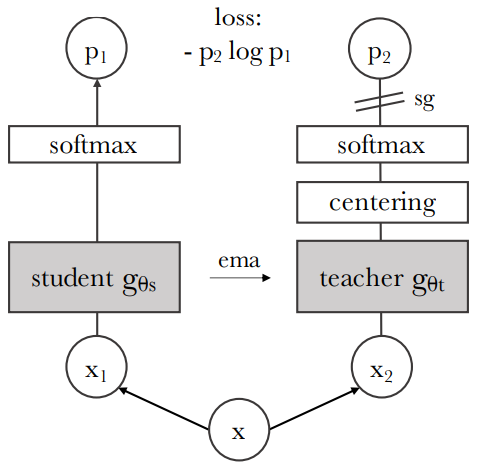
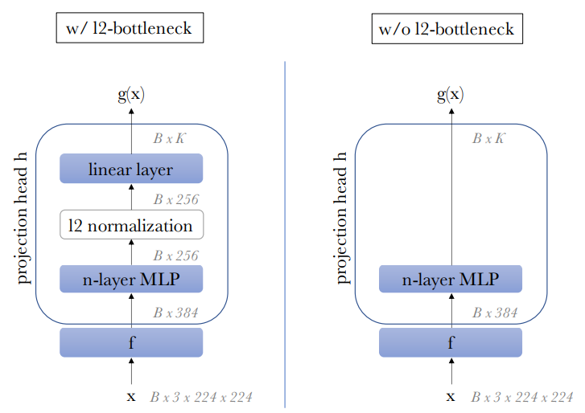
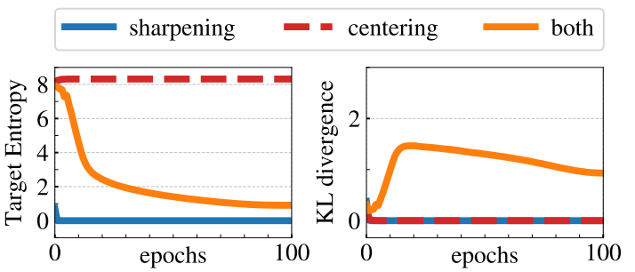

# 
 DINO 

[Emerging Properties in Self-Supervised Vision Transformers, 2021](https://arxiv.org/pdf/2104.14294.pdf)

## Motivation
作者认为虽然一些视觉 Transformer 模型借助NLP的训练策略，即通过在大规模数据集上预训练然后在目标数据集上微调，可以达到很好的效果，但是相较于传统的 CNN 模型并没有表现出明显的优势。

因此，作者在这篇文章中怀疑视觉 Transformer 没有取得类似于 NLP 中那样显著的成就的原因是在视觉 Transformer 模型在预训练阶段使用了 supervised learning，而不是 self-supervised learning。具体来说，由于图像级别的监督需要预先定义的标签，而这些标签并不能完全反映图像中所有有意义的的信息，因此使用图像级别的监督训练模型会导致模型忽略一些有意义的信息。

作者认为 NLP 中 Transformer 的成功的因素之一是 self-supervised pretraining。

## Findings
作者研究了 self-supervised pretraining 对 ViT 特征的影响。

- 作者发现，self-supervised ViT 特征显式地包含场景的 layout，尤其是目标的边界信息。（这些信息可以直接通过最后一个self-attention modules得到）

- 作者发现，self-supervised ViT 的特征可以使基础的 k-NN（nearest neighbor classifier) 在 ImageNet 上获得不错的性能，而不需要finetuning，linear classifier 和 data augmentation。（作者又提到，只有结合一些组件，如momentum encoder 和 multi-crop augmentation，K-NN 才能获得较好的性能）

- 作者发现，使用较小的 patch size 有助于提高 ViT 生成的特征的质量。

## DINO (Details)
基于上述发现，作者提出了一种简单的 self-supervised 方法，DINO（**di**stillation with **no** labels）.
### Self-Supervised Learning with Knowledge Distillation
#### Knowledge Distillation
- Knowledge distillation 是一种学习范式： 训练一个 Student 模型来模仿一个 Teacher 模型的输出。具体来说，对于输入图像 x， Teacher 模型（参数为 $\theta_t$）在训练阶段输出一个概率分布 $P_t(x)$，而 Student 模型（参数为 $\theta_s$）在训练阶段输出一个概率分布 $P_s(x)$。$$P_s(x)^{(i)} = \frac{\exp(g\theta_s(x)^{(i)}/\tau_s)}{\sum_{i=1}^K \exp(g\theta_s(x)^{(k)}/\tau_s)}$$，其中 `k` 是输出的维度, `g` 表示模型的方程（Teacher 和 Student 的模型结构相同），$\tau_s$ 是一个温度参数，用于控制 [sharpness](#avoiding-collapse) of the distribution。

- 给定一个 Teacher 模型及其输出的概率分布 $P_t(x)$，通过在 Student 参数下**最小化 cross-entropy loss来训练 Student 模型**。$$\min_{\theta_s} \mathbf{H}(P_t(x), P_s(x))$$，其中 $\mathbf{H}(a,b) = -a\log b$ 。

- Teacher 并不进行梯度计算，而是[通过 EMA 更新参数](#teacher)。

#### Self-Supervised Learning
- 作者使用了一个类似 self-distillation 的方式来训练模型。具体来说，作者使用一个 momentum Teacher 模型来指导 Student 模型的训练。

    

    
    

- 为了进行 self-supervised training，作者使用了 [multi-crop strategy](https://arxiv.org/abs/2006.09882) 对输入图像进行处理。具体来说，作者定义了两种 distorted views:   
[1]. global views: two views ($x_1^g$, $x_2^g$), croped size > 50% of original size.  
[2]. local views: several views, cropped size < 50% of the original size.  
其中，global 和 local views 被输入到 Student，而 Teacher 仅使用 global views。$$\min_{\theta_s} \sum_{x\in {x_1^g, x_2^g}}\sum_{x'\in V, x'\neq x} \mathbf{H}(P_t(x), P_s(x')), V=set(global + local veiws)$$，通过这种方式鼓励 'local-to-global' 的相互对应关系。

### Loss
- 作者使用 cross-entropy loss (CE) 训练模型。$$\min_{\theta_s} \mathbf{H}(P_t(x), P_s(x))$$，其中 $\mathbf{H}(a,b) = -a\log b$ 。

- 此外，作者发现对于 ViT-Small 模型，使用更多的 epoch 可以提升模型的性能。（对于其他模型，如 ViT-B/16，并没有进一步的测试）

| DINO ViT-S | 100-ep | 300-ep | 800-ep | 
|------------|--------|--------|--------|
| k-NN top-1 | 70.9   | 72.8   | 74.5   |

### [Teacher](#teacher)
- Teacher 与 Student 具有相同的结构，但是参数不共享。具体来说，Teacher 的参数通过 exponential moving average (EMA) 将 Student 之前迭代的参数更新到 Teacher 中。  
    - 作者研究了 Teacher 参数的不同的更新方式，然后发现在他们的框架下，将 Teacher 参数冻结超过一个 epoch 会得到意想不到的好结果～ 而从 Student 拷贝参数到 Teacher 会导致模型不收敛。
    - EMA 更新规则：$\theta_t ← \lambda\theta_t + (1 - \lambda)\theta_s$，在训练过程中 $\lambda$ 遵循 cosine schedule 更新策略从 0.996 更新到 1.0。
    - 作者观察到 Teacher 的性能优于 Student，因此可以提供更高质量的目标特征以引导 Student 的训练过程。（这一现象在之前其他的工作中并没有被观察到）

- 此外，相较于作者使用的 momentum Teacher，使用前一个 epoch 的 Student 作为 Teacher 也可以获得不错的结果。因此，使用何种 Teacher 策略仍然需要探索。

### Network Architecture
- 网络由一个 backbone 和一个 projection head 组成。
    - backbone (ViT 或 ResNet) 的输出特征被用于下游任务。
    - projection head 用于在预训练阶段学习特征（并不用于下游任务）。具体来说，它由一个有3个 layer 的 MLP 组成，其中 hidden layer 的维度为 2048，输出层是一个维度为 K 的 weight normalized fully connected layer。（作者测试了不同的 projection head，发现这个结构的DINO表现最好）

    

    
    

    - 由于 ViT 结构没有使用 batch normalization（BN），因此作者在训练 ViT 时没有使用 BN。（使用 BN 会导致模型性能下降～1%）对于 ResNet，作者使用 BN。

### [Avoiding collapse](#avoiding-collapse)
- 作者在本文使用的简单的方案来避免 collapse，即 centering 和 sharpening。其中 centering 避免某一维度主导训练过程，但其鼓励输出维度服从均匀分布进而造成 uniform distribution collapse，即每个维度的输出都有相同的概率。而 sharpening 的效果刚好相反。
    - Centering 操作： $g_t(x) \leftarrow g_t(x) + c$，其中 center `c` 通过 EMA 更新，以适应不同的 batch size：$$c \leftarrow + mc + (1 - m) \frac{1}{B}\sum_{i=1}^B g\theta_t(x_i)$$, 其中 `m` 是一个 momentum 参数，`B` 是 batch size。
    - 作者测试了不同的 `m` 值，发现模型对 `m` 不敏感，但是当 `m` 较大时（如0.999，center 的更新速度太慢），模型会 collapse。 
    
    

    | m           |  0   | 0.9  | 0.99 | 0.999 | 
    |-------------|------|------|------|-------|
    | k-NN top-1  | 69.1 | 69.7 | 69.4 |  0.1  |

    

    - Sharpening 操作通过在 Teacher 的 softmax normalization 中设置一个较小的温度参数 $\tau_t$ 来实现。$$ P_t(x) = \frac{\exp(g_t(x)/\tau_t)}{\sum_{i=1}^K \exp(g_t(x)^{(k)}/\tau_t)}$$
    $\tau_t$ 的值越小，输出的概率分布越尖锐，因此可以避免 uniform distribution collapse。相反，$\tau_t$ 的值越大，输出的概率分布越平滑。（这一策略常用于 knowledge distillation 中）
    - 作者测试了不同的 $\tau_t$ 值，发现 temperature 小于 0.06 时，才能避免 collapse。

    

    | $\tau_t$ | 0 | 0.02 | 0.04 | 0.06 | 0.08 |0.04 $\rightarrow$ 0.06|
    |----------|---|------|------|------|------|--|
    | k-NN top-1 | 43.9 | 66.7 | 69.6 | 68.7 | 0.1 | 69.7 |
    
     $\tau \rightarrow 0$ (extreme shaprpening) correspond to the `argmax` operation  
     and leads to one-hot hard distributions.

    

- 此外，作者通过将 cross-entropy loss 分解为 entropy 和 KL divergence 来进一步分析 Centering 和 Sharpening 的协作。
    
    $$\begin{aligned}
    \mathbf{H}(P_t(x), P_s(x)) &= -\sum P_t(x)\log P_s(x) \\
    & = -\sum P_t(x) \log P_t(x) + \sum P_t(x) \log \frac{P_t(x)}{P_s(x)} \\
    & = \mathbf{H}(P_t(x)) + \mathbf{KL}(P_t(x), P_s(x))
    \end{aligned}$$  

    

    
    

    - 如果 KL divergence 为 0，那么意味着 Teacher 和 Student 的输出分布相同，因此在 knowledge distillation 训练框架下将不会有任何的信息传递和梯度更新，即模型会 collapse。如上右图所示，当仅使用 centering 或 sharpening 时，KL divergence 为 0，因此模型会 collapse。
    - 另一方面，$\mathbf{H}(P_t(x))=-\sum P_t(x) \log P_t(x)$，上左图显示了当仅使用 sharpening 时，Teacher 模型的 Target Entropy 会收敛到 0；这意味着 Teacher 的输出受某一维度的主导，从而导致模型 collapse。
    
    - 而当仅使用 centering 时，Target Entropy 会收敛到 $-\log(1/K)$，这意味着模型的输出服从 uniform distribution。从而无法学习到有用的信息。
    （[根据熵的极值性](https://zh.wikipedia.org/zh-hans/熵_(信息论)#极值性)）: $$\mathbf{H}(P_t(x)) \leq -\log(1/K)$$

    - 因此，作者认为 centering 和 sharpening 是互补的，因为它们可以避免 uniform distribution collapse 和 entropy collapse。

    
    

