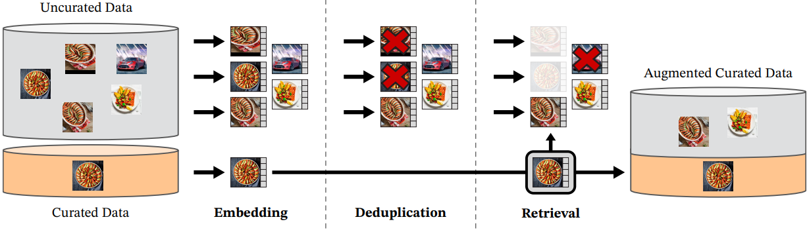

# 
 DINOv2 

[DINOv2: Learning Robust Visual Features without Supervision, 2023](https://arxiv.org/pdf/2304.07193.pdf)  
[DINOv2: State-of-the-art computer vision models with self-supervised learning (blog)](https://ai.meta.com/blog/dino-v2-computer-vision-self-supervised-learning/)

---
## Limitations of DINO
- DINO 类模型以及其他 SSL 方法很难在经典的 ImageNet 范围之外进行训练，从而限制了它们在研究中的使用。

## Before Reading
-  image-text 预训练的局限性。
    - 作者认为 image-text 预训练依赖手工设计的标题来学习图像中的语义信息，因此会使模型忽略一些在文字描述中没有明确描述的信息。（比如，一个巨大的紫色房间中的椅子的图片的标题可能写成“一把椅子”。这个标题忽略了有关背景的重要信息，如椅子在房间中的位置。）所以，作者认为基于标题的特征缺乏对图像中的语义信息的全面理解（局部信息和全局信息），并且可能导致需要详细局部信息的下游任务的性能不佳。
    - *然而，这个局限性也切好反过来说明了 image-text 预训练的优势。比如，文本描述可以为图像提供特定的 focus，从而使模型更容易学习到有用的信息。*

- DINOv2 在下游任务中取得了SOTA的性能，如 Semantic Segmentation 和 Depth estimation。

## Ideas & News
- 作者认为数据的质量和多样性是影响模型产生特征的重要因素。因此本文作者探索利用 self-supervised learning 在大量精选的数据上学习通用的视觉特征 (all-purpose visual features)。为此，作者设计了一个 automatic pipeline 用来从大量非精心挑选的数据中对数据进行 filter 和 rebalance（最后得到 142 million images），从而避免模型在某几个主导模式上过拟合。

- 大规模数据集以及大模型会导致会造成训练过程不稳定，因此作者使用了额外的正则化方法使训练更加稳定。

- 更高效的模型实现。（最新的混合精度和分布式训练 in PyTorch2.0，高效的stochastic depth technique，和最新的 xFormers 的算法实现）

- 为了降低大模型在推理阶段对硬件的要求，且由于 DINO 算法基于 self-distillation，因此可以直接将大模型压缩为较小的模型，并尽可能地保留其性能。

## Data Pipeline

    

1. Crawled web images
    - Download uncurated images from the web.
    - Post processing. (PCA hash deduplication, NSFW filtering, and blurring identifiable faces)

2. Deduplication
    - 作者使用 copy detection pipeline 来删除训练和测试数据中重复的或类似重复的图片。从而减少冗余并提高数据的多样性。

3. Self-supervised image retrieval
    - 从大量的 uncurated images 中 retrive 与 curated sourecs 中的图片相似的图片，然后将 curated sources 数据与 retrived 图像合并。
    - 使用在 ImageNet-22K 上预训练的 ViT-H/16 模型提取图像的 embedding， 然后根据 cosine-similarity 作为距离测量指标将图像聚类（k-means）。

## Discriminative Self-supervised Pre-training
- 作者通过 discriminative self-supervised method 训练模型。其中 discriminative self-supervised method 可以被看作是多个损失函数或正则化项的组合。（作者主要从之前发表的一些工作中借鉴了一些方法，如 DINO, iBOT, SwAV 等）

## Efficient Implementation
- 作者实现了 FlashAttention, 从而提升内存的使用效率并加速 self-attention 的计算。（作者发现当每个 head 的维度为 64 的倍数时，效率最高，而对于矩阵操作，embedding 的维度为 256 的倍数时效率最高。）
